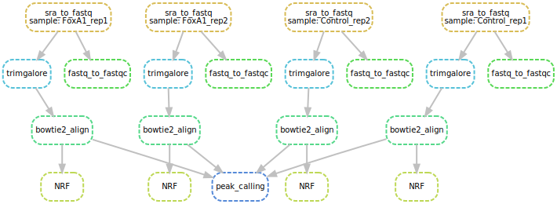

## ChIP-seq pipeline

This repository contains a pipeline for the analysis of the Transcription Factor ChIP-seq (TF ChIP-seq) data. 

__Motivation__

The aim was to create a standard TF ChIP-seq pipeline that included quality controls, data analysis and visualisation.
The pipeline has been developed using [Snakemake](http://snakemake.readthedocs.io/en/stable/), a tool to create reproducible and scalable data analyses.

It was primed by Bruce for its Bachelor's project, and then improved by Federico to become a tool than could be applied to any set of ChIP-seq experiments.

__Requirements__

* [Snakemake](http://snakemake.readthedocs.io/en/stable/) with [Python](https://www.python.org/downloads/) >= 3.6 (`os`, `sys`, `re`, `pysam` and `itertools` modules)
* [_SRA Toolkit_](https://trace.ncbi.nlm.nih.gov/Traces/sra/sra.cgi?view=software)
* [_FastQC_](https://www.bioinformatics.babraham.ac.uk/projects/fastqc/)
* [_Trim Galore!_](https://www.bioinformatics.babraham.ac.uk/projects/trim_galore/) and its dependency [_Cutadapt_](https://cutadapt.readthedocs.io/en/stable/)
* [_Bowtie2_](http://bowtie-bio.sourceforge.net/bowtie2/index.shtml)
* [_MACS2_](https://github.com/taoliu/MACS)

---

### Example

This illustrative case employs data from [Franco HL, _et al._, 2015](https://www.ncbi.nlm.nih.gov/pubmed/25752574).
For the sake of time, it focuses only on _FoxA1 Vehicle_ ChIP-seq and its control samples without considering any of the treatments.

The Sequence Read Archives (SRA) files can be retrieved from [GEO: GSE59530](https://www.ncbi.nlm.nih.gov/geo/query/acc.cgi?acc=GSE59530).

Since it is a bit tricky to provide remote files as input in Snakemake, the original data is downloaded externally using `curl` and the `SraAccList.txt` file present in the main folder.

```
# Create the output folder
mkdir -p data

# Cycle through the identifiers in 'SraAccList.txt' and download the corresponding file
for sra in `awk '{print $1}' SraAccList.txt`; do
    curl "ftp://ftp-trace.ncbi.nih.gov/sra/sra-instant/reads/ByRun/sra/SRR/${sra:0:6}/$sra/$sra.sra" --output data/$sra
done
```

Once the download is finished, open the configuration file ('config.yaml') in the main folder and set the correct paths.
If they do not exists, some of the paths (i.e., results and bowtie2) will be generated during the first run.

Finally, you can type the following command to execute the whole pipeline:

```
snakemake
```

In case you would like to perform only the alignment to the genome (no peak calling), you can run:

```
snakemake map
```

__[Optional] Directed acyclic graph (DAG)__

The DAG, which shows the computational steps that each sample is going through, can be generated using:

```
snakemake dag
```

or you can generate it for the whole workflow with:

```
snakemake dag_complete
```



Figure 1: Schematic of the pipeline workflow.

---

### Pipeline breakdown

#### Steps description

* Quality control on the raw data
    - Performed with FastQC
* Trimming of the adapter sequence
    - Performed with Trim Galore!
* Alignment to the genome
    - Performed with Bowtie2
* Calculation of the non-redundant fraction (NRF) metric
* Generation of bigWig for visualisation (NOT YET!)
    - Performed using the ENCODE binaries
* Peak calling
    - Performed using Macs2
* Visualisation of the results (Bruce forgot to commit this one...)

#### [FastQC](https://www.bioinformatics.babraham.ac.uk/projects/fastqc/)

FastQC aims to provide a simple way to do some quality control checks on raw sequence data coming from high throughput sequencing pipelines. It provides a modular set of analyses which you can use to give a quick impression of whether your data has any problems of which you should be aware before doing any further analysis.

#### [Trim Galore!](https://www.bioinformatics.babraham.ac.uk/projects/trim_galore/)

Trim Galore! is a wrapper script to automate quality and adapter trimming as well as quality control, with some added functionality to remove biased methylation positions for RRBS sequence files (for directional, non-directional (or paired-end) sequencing).

#### [Bowtie2](http://bowtie-bio.sourceforge.net/bowtie2/index.shtml)

Bowtie 2 is an ultrafast and memory-efficient tool for aligning sequencing reads to long reference sequences.

#### [NRF.py](scripts/NRF.py)

This custom script calculates _Non-Redundant Fraction_ (NRF = Unique start positions of uniquely mappable reads / Uniquely mappable reads).

#### Cross-correlation (not yet implemented)

Strand cross-correlation is computed as the Pearson correlation between the positive and the negative strand profiles at different strand shift distances, k.

#### [MACS2](https://github.com/taoliu/MACS)

MACS captures the influence of genome complexity to evaluate the significance of enriched ChIP regions, and MACS improves the spatial resolution of binding sites through combining the information of both sequencing tag position and orientation. MACS can be easily used for ChIP-Seq data alone, or with control sample with the increase of specificity.

_NB: Presently, the algorithm performs the peak calling using a control (must have 'Control' in the sample name) and treatment (everything else)._

#### Consistency of replicates (not yet implemented)

Calculate the Irreproducible Discovery Rate (IDR).

#### Visualize the results (not yet implemented)

---

### To-Do list

  - Cluster support (will be done very soon!)
  - BigWig coverage files
  - Matching function for conditions/controls
  - Paired-end reads support
